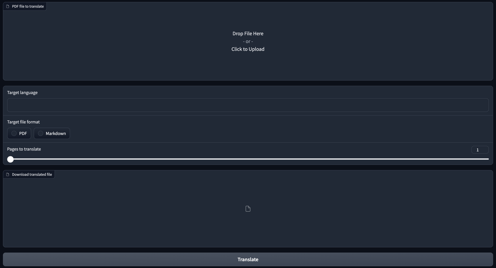

# OPENAI Translator V2

## What I have done

1. Created a UI with gradio to run the translator
   

2. In the UI, it supports:

   - target language

   - pages to translate

   - target file format

## What I haven't done

1. When translate into languages other than Chinese, it seems has some unexpected results esp. for the tables. I haven't gotten time to fix it

2. Put the translated text into original format

3. Implement a API to provide the services
